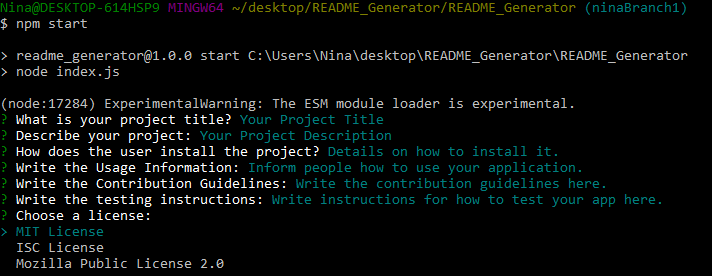

# README_Generator

## Description

This application uses Node.js to help a user write a professional README.md for any GitHub project. 

## Table of Contents

1. [Instructions](#instructions)
2. [Usage](#usage)
3. [License](#license)
4. [Contributing](#contributing)
5. [Questions](#questions)

## Instructions

First, make sure you have [Node.js](https://nodejs.org/en/) installed on your computer. Next, clone the repository to your computer. Once it's cloned, open the directory in your CLI and run "npm init" to create your package.json. Next, run "npm i" to install the dependencies. Now you can run the application using "npm start".

## Usage

The application will ask the user a series of prompts (ex: "What is your project title?"). Once all the prompts are answered, the responses will be formatted and saved to a new file in the "readme_exports" directory. The filename will be a timestamp of when the file was created.

## License

This application is covered under the MIT License.

## Contributing

Contributions are welcome. Please create a pull request with your changes for me to review.

## Questions

If you have further questions, please email me at nckoller@gmail.com.
